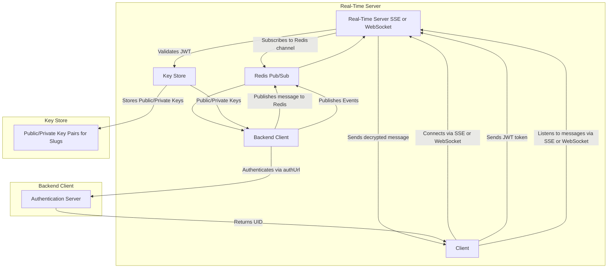

# RFC - Serveur Temps Réel Centralisé (SSE/WebSocket + Redis)

## 📘 Titre

Spécification d’un serveur temps réel auto-hébergé, multi-backends, sécurisé, basé sur SSE/WebSocket + Redis, avec chiffrement intégré et système d’authentification déléguée.

---

## 🎯 Objectif

Créer un serveur de diffusion temps réel :

- pour clients web/mobiles (via SSE/WebSocket)
- piloté par des backends tiers auto-enregistrés
- sécurisé via des tokens et du chiffrement asymétrique
- **centralisé**, **scalable**, **multi-tenant** par `slug`



---

## 🧱 Composants

| Composant                        | Rôle                                                                    |
| -------------------------------- | ----------------------------------------------------------------------- |
| **Client (Browser)**             | Écoute les messages en SSE/WebSocket                                    |
| **Serveur Temps Réel (Gateway)** | Gère les connexions, déchiffre, valide, diffuse                         |
| **Redis Pub/Sub**                | Système de messagerie entre processus                                   |
| **Backend Client**               | Service externe qui publie les messages et authentifie les utilisateurs |
| **Key Store (interne)**          | Géré par le serveur lui-même, stocke les paires de clés des slugs       |

---

## 🔐 Authentification et Sécurité

### Authentification utilisateur

- Lors de l’ouverture de la connexion SSE, le client envoie un **token (JWT, Basic, etc.)**
- Le serveur appelle l’URL d’authentification du `slug` enregistré
- Le backend client valide le token et retourne un `UID`

### Clé asymétrique interne

- Lors de l’enregistrement d’un backend, **le serveur génère la paire clé publique/clé privée**
- Le backend client **ne gère aucune clé lui-même**
- Les messages sont :
  - **chiffrés** par le backend client avec la clé publique récupérée via API
  - **déchiffrés** par le serveur à la réception via Redis

---

## 🔁 Flux d’inscription backend

### `POST /backends/register`

```json
{
  "slug": "myapp",
  "authUrl": "https://myapp.com/auth/validate",
  "authType": "jwt" // ou "basic"
}
```

➡️ Le serveur :

- vérifie l’unicité du `slug`
- génère la paire de clés
- stocke les métadonnées + la clé privée en interne

---

## 📤 Publication de messages

### Envoi ciblé (vers un seul UID)

```json
{
  "slug": "myapp",
  "uid": "user-123",
  "event": "notification:new",
  "payload": "ENCRYPTED_STRING_BASE64"
}
```

### Envoi global (broadcast)

```json
{
  "slug": "myapp",
  "event": "maintenance:start",
  "payload": "ENCRYPTED_STRING_BASE64",
  "broadcast": true
}
```

- Le serveur SSE est abonné à `slug:*`
- En cas de `broadcast: true`, tous les clients de ce `slug` recevront l’événement

---

## 🔌 Ouverture de connexion SSE

- `GET /events/:slug`
- Headers :
  - `Authorization: Bearer <token>` ou autre selon `authType`

➡️ Le serveur :

- Authentifie le token via l’`authUrl`
- Obtient un `uid`
- S’abonne à `slug:uid` **et** `slug:broadcast` sur Redis

---

## 🔑 Récupération de la clé publique

Le backend peut obtenir la clé publique pour chiffrer les messages :

### `GET /backends/:slug/public-key`

➡️ Retourne la clé publique associée, pour chiffrer côté client.

---

## 🔐 Exemple de réponse d’auth

```json
{
  "uid": "user-123"
}
```

---

## 🧪 Exemple de message Redis

```json
{
  "slug": "myapp",
  "uid": "user-123",
  "event": "chat:new",
  "payload": "ENCRYPTED_STRING"
}
```

ou

```json
{
  "slug": "myapp",
  "event": "maintenance:start",
  "payload": "ENCRYPTED_STRING",
  "broadcast": true
}
```

---

## 🗃️ Stockage local

Pour chaque `slug`, le serveur conserve :

- `authUrl`
- `authType`
- `publicKey`
- `privateKey`

---

## 🔄 Scalabilité

- Le serveur est stateless
- Redis Pub/Sub synchronise tous les messages entre les instances
- Chaque instance peut gérer plusieurs connexions SSE/WebSocket en parallèle

---

## ✨ Extensions possibles

- WebSocket fallback + multiplexing
- Signature des messages pour garantir l’intégrité
- TTL automatique pour les connexions
